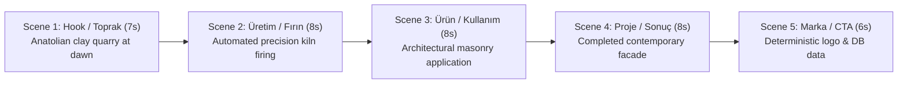
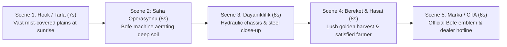

# Long Video Benchmark Specification (30–60s Multi-Scene Commercials)

This document establishes the architecture, scene contracts, narrative progression, and continuity QA standards for multi-scene long-form commercials (30–60 seconds).

---

## 1. Core Long-Form Commercial Invariants

Long-form commercials cannot be generated as a single unconstrained generative prompt due to model drift, hallucination accumulation, and duration limitations. They are built as **multi-scene compositions** governed by deterministic constraints:

1. **Tek Hikâye (Single Coherent Narrative)**: The entire 30–60s arc must tell one unified narrative progression (Hook $\rightarrow$ Conflict/Development $\rightarrow$ Product Action $\rightarrow$ Result $\rightarrow$ Brand CTA).
2. **Voice-Over Tekrar Yok (Strict VO Deduplication)**: No repetition of phrases, rhetorical questions, or taglines across consecutive scenes. Each scene advances the verbal narrative.
3. **Ürün Görünümü Tutarlılığı (Cross-Scene Product Continuity)**: The physical appearance, silhouette, materials, and colors of the featured product must remain identical from Scene 1 through Scene 5.
4. **Aynı Marka (Single Brand Invariant)**: Only the authorized tenant brand is represented. Zero competing or generic AI-hallucinated brands.
5. **Yabancı Logo Yok (Zero Foreign Logos)**: Absence of foreign watermarks, synthetic corporate badges, or AI gibberish emblems.
6. **Final Logo Gerçek Asset (Deterministic Logo Asset)**: The closing brand emblem must be the client's official vector SVG / high-res transparent PNG overlaid deterministically via FFmpeg.
7. **Final CTA Gerçek Database Verisi (Deterministic Database CTA)**: The URL, phone number, address, and campaign slogan are pulled directly from the tenant database record and rendered with validated typography.

---

## 2. Benchmark Case A: Ayvazoğlu (35–40s Commercial)

- **Benchmark ID**: `LONG-AYVAZOGLU-COMMERCIAL-01`
- **Brand**: Ayvazoğlu
- **Sector**: Architectural Masonry & Building Materials
- **Target Runtime**: 35–40 seconds (5 Scenes)
- **Aspect Ratio**: 16:9 (Broadcast & Web Landscape)

### Scene-by-Scene Narrative Structure



| Scene # | Scene Name | Duration | Visual Narrative | Voice-Over Script (Turkish) | Invariant / Focus |
|---|---|---|---|---|---|
| **Scene 1** | **Hook / Toprak / Malzeme** | 7s | Cinematic macro shot of natural red clay soil in an Anatolian quarry at sunrise. Golden sunbeams illuminating fine mineral particles. | *"Her büyük yapı, toprağın en saf haliyle başlar. Yüzlerce yıllık birikim, doğanın en dayanıklı formuyla buluşuyor."* | Soil realism, zero industrial trash or foreign plastics. |
| **Scene 2** | **Üretim / Fırınlama** | 8s | High-tech brickworks facility. Automated precision cutters slicing clay into rectangular blocks, entering a glowing continuous tunnel kiln. | *"Geleneksel hammadde, ileri teknoloji ve bin dereceyi aşan fırınlarımızda milimetrik hassasiyetle işlenir."* | Correct industrial brick manufacturing; no molten metal or blast furnaces. |
| **Scene 3** | **Ürün / Mimari Kullanım** | 8s | Precision bricklayer placing the identical terracotta brick onto clean mortar line on a contemporary building facade with spirit level. | *"Her tuğla; ısı yalıtımı, yangın direnci ve zamansız estetik için kusursuz bir denge sunar."* | Exact same brick model as Scene 2 (color, porous cavities, planar edges). |
| **Scene 4** | **Proje / Sonuç** | 8s | Wide panoramic architectural reveal of completed luxury residential and cultural building constructed with Ayvazoğlu bricks. | *"Nesiller boyu ayakta kalan, nefes alan ve güven veren yaşam alanları için..."* | Structural integrity; completed architectural grandeur in evening light. |
| **Scene 5** | **Marka / Kararlı CTA** | 6s | Elegant branded background plate with subtle warm shimmer. Official vector SVG logo and dynamic database CTA overlay. | *"Ayvazoğlu Tuğla. Geleceğin mimarisine sağlam temel."* | **Deterministic**: Phone (`+90 384 511 40 00`), URL (`www.ayvazoglutuðla.com`). |

---

## 3. Benchmark Case B: Bofe (35–40s Commercial)

- **Benchmark ID**: `LONG-BOFE-COMMERCIAL-01`
- **Brand**: Bofe
- **Sector**: Tarım Makineleri / Agricultural Machinery
- **Target Runtime**: 35–40 seconds (5 Scenes)
- **Aspect Ratio**: 16:9

### Scene-by-Scene Narrative Structure



| Scene # | Scene Name | Duration | Visual Narrative | Voice-Over Script (Turkish) | Invariant / Focus |
|---|---|---|---|---|---|
| **Scene 1** | **Hook / Tarla / Sezon** | 7s | Majestic wide drone shot of vast agricultural field bathed in golden dawn mist. Farmer inspecting soil ahead of planting season. | *"Toprak emek ister, zamanlama ister. Her yeni sezon, çiftçimizin alın teriyle filizlenir."* | Pure agricultural context. **FORBIDDEN**: car wash, domestic lawn, city traffic. |
| **Scene 2** | **Operasyon / Tarla** | 8s | Bofe heavy-duty soil cultivator hitched to tractor, high-tensile steel tines aerating fertile dark soil with steady torque. | *"Zorlu zemin koşullarına meydan okuyan Bofe tarım makineleri, toprağı en verimli şekilde hazırlar."* | Mechanical authenticity. **FORBIDDEN**: handheld power drills, jackhammers. |
| **Scene 3** | **Detay & Dayanıklılık** | 8s | Low-angle dynamic sweep tracing the reinforced yellow/green alloy chassis and sealed hydraulic joints operating under load. | *"Özel alaşımlı çelik gövde ve dayanıklı hidrolik mimari, en ağır yük altında bile kesintisiz güç sağlar."* | Machine identity identical to Scene 2; no plastic warping or toy parts. |
| **Scene 4** | **Hasat & Verim** | 8s | Golden wheat field at peak harvest. Farmer smiling as he inspects heavy wheat heads, tractor and Bofe rig in proud background. | *"Daha az yakıt, daha yüksek verim. Emeğiniz berekete dönüşsün."* | Bountiful crop; farmer satisfaction; healthy agricultural yield. |
| **Scene 5** | **Marka / CTA** | 6s | Solid forest green background with warm solar backlight. High-res Bofe vector emblem with official dealer inquiry phone and URL. | *"Bofe Tarım Makineleri. Toprağınızın güvencesi."* | **Deterministic**: Phone (`+90 850 440 26 33`), URL (`www.bofemakina.com.tr`). |

---

## 4. Multi-Scene Continuity & Cross-Scene Verification

### Keyframe Sampling Grid per Scene
In every scene $S_i$ of length $L_i$:
- **Frame A (15% timestamp)**: Scene entrance stability and lighting match.
- **Frame B (50% timestamp)**: Mid-scene action peak and product geometry.
- **Frame C (85% timestamp)**: Scene climax.
- **Scene End Frame ($L_i - 1$ frame)**: Recorded and hashed.

```
Scene i:   [ 15% ] ─────── [ 50% ] ─────── [ 85% ] ─────── [ End Frame ]
                                                                   │
                                                                   ▼ (Continuity Match)
Scene i+1: [ Start Frame ] ──── [ 15% ] ──── [ 50% ] ─────────────
```

### Parent End-Frame to Child Start-Frame Protocol
When two consecutive scenes share the same continuous physical space or character:
1. Extract last rendered frame of $S_i$: `frame_end(S_i)`.
2. Extract first rendered frame of $S_{i+1}$: `frame_start(S_{i+1})`.
3. Compute perceptual structural similarity:
   $$\text{SSIM}(\text{frame\_end}(S_i), \text{frame\_start}(S_{i+1})) \ge 0.65$$
4. Check for sudden lighting temperature flips (e.g. dawn to midnight) or wardrobe/machine model shifts.

---

## 5. Audio & Voice-Over Mastery Rules

1. **VO Script Validation**:
   - Total word count strictly capped: $\text{Words} \le \text{Duration (seconds)} \times 2.3$ words/sec.
   - Text passed through deduplication filter (Levenshtein phrase similarity $< 0.40$).
2. **Audio Track Alignment**:
   - Voice-over rendered as independent clean stems (24-bit, 48kHz WAV).
   - Background music ducked to $-18\text{dB}$ during voice-over utterances.
   - Master composite mastered to **EBU R128 (-14 LUFS $\pm 1$ LUFS)** standard.
