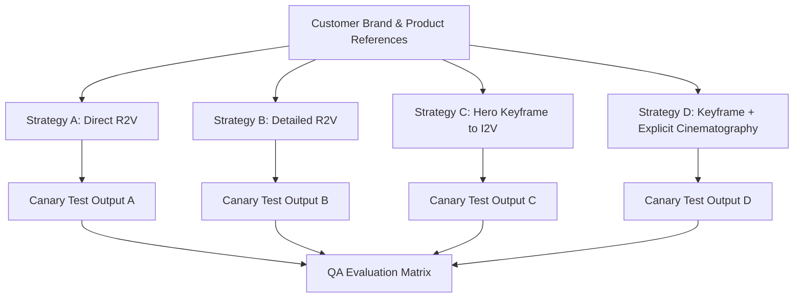

# Prompt A/B Test Pack: Comparative Video Generation Strategies

This pack establishes standardized prompt strategies across identical brand briefs to evaluate which generation pattern achieves optimal product fidelity, cinematic quality, motion realism, and brand alignment.

---

## 1. The 4 Generation Strategies

When generating commercials from customer inputs (brand kit, logo, product reference photos, objective), the system can apply four distinct prompt engineering patterns:



### Strategy Summary

| Strategy Code | Strategy Name | Core Mechanics | Primary Hypothesis |
|---|---|---|---|
| **Strategy A** | **Direct R2V** | Reference image passed directly to video generator with brief semantic description. | Fast execution, low token overhead; tests model's zero-shot visual grounding. |
| **Strategy B** | **Detailed R2V** | Reference image accompanied by exhaustive physical descriptions (materials, finish, mechanical joints, RGB palette). | Explicit text constraints reduce model morphing and preserve fine hardware details. |
| **Strategy C** | **Hero Keyframe $\rightarrow$ I2V** | Generate a high-resolution, photorealistic hero keyframe via text-to-image/image-edit first, then feed approved frame into Image-to-Video. | Decouples spatial composition from temporal motion, granting higher geometry control. |
| **Strategy D** | **Keyframe + Explicit Cinematography** | Hero keyframe animated with exact camera rig parameters (focal length, sensor size, aperture, camera path, lighting physics). | Maximizes cinematic elegance and eliminates erratic amateur camera motions. |

---

## 2. Test Pack: Bofe Agricultural Sprayer (`SHORT-BOFE-HERO-01`)

### Input Assets
- Reference Image: `bofe_sprayer_hero.png` (Yellow tank, green chassis, hydraulic mist boom).
- Sector: Tarım Makineleri (Agricultural Machinery).
- Aspect Ratio: `9:16` (Vertical Commercial).
- Target Duration: 10s.

---

#### Strategy A: Direct R2V Prompt
```text
[REFERENCE: bofe_sprayer_hero.png]
Commercial video of the agricultural sprayer shown in the reference image. The machine is stationed in a sunny agricultural field, cinematic lighting, high quality, 4k.
```

#### Strategy B: Detailed R2V Prompt
```text
[REFERENCE: bofe_sprayer_hero.png]
A heavy-duty agricultural boom sprayer with identical proportions to the reference image: vivid industrial yellow chemical tank with embossed Bofe markings, dark forest green tubular steel chassis, dual folding spray booms with silver brass nozzles. Positioned in a tilled agricultural field at golden hour. Warm sunrise light catches the metallic edges. Camera performs a smooth slow dolly forward. Grounded physics, realistic moist soil particles, zero distortion of mechanical arms, no passenger cars or urban elements.
```

#### Strategy C: Hero Keyframe $\rightarrow$ I2V
- **Step 1 (Keyframe Generation Prompt)**:
  ```text
  Commercial catalog photography of the agricultural sprayer from the reference image, parked in a fertile Anatolian wheat field at dawn. Ultra-sharp details, accurate mechanical geometry, yellow tank, green steel framework, morning dew on metal, low-angle hero perspective, 85mm portrait lens, commercial advertising lighting, photorealistic 8k.
  ```
- **Step 2 (I2V Animation Prompt)**:
  ```text
  [INPUT_FRAME: Approved_Keyframe_01.png]
  Smooth slow-motion push-in toward the agricultural sprayer. The morning mist gently drifts across the tilled soil in the background. Soft golden light flickers across the steel frame. Rigid mechanical stability, zero warping of the yellow tank, zero morphing of wheels.
  ```

#### Strategy D: Keyframe + Explicit Cinematography
- **Step 1 (Keyframe Generation)**: Same as Strategy C.
- **Step 2 (Cinematography-Constrained I2V Prompt)**:
  ```text
  [INPUT_FRAME: Approved_Keyframe_01.png]
  Camera Rig: Technocrane mounted on dolly track.
  Focal Length: 50mm anamorphic prime lens, T2.0 aperture with subtle oval bokeh.
  Camera Motion: Precise linear push-in along the central optical axis at 0.5 meters per second. Pitch: -5 degrees looking up. Zero roll, zero erratic handheld shake.
  Lighting Physics: Key light warm tungsten sunrise at 2800K from camera right (45 degrees), soft ambient sky fill at 6500K. Specular highlights glide realistically along the curved yellow tank and dark green chassis.
  Environmental Motion: Fine airborne mist particles drift laterally from left to right at 1 m/s. Soil remains static.
  Duration: Exactly 10.0 seconds.
  ```

---

## 3. Test Pack: Ayvazoğlu Terracotta Bricks (`SHORT-AYVAZOGLU-CINEMATIC-01`)

### Input Assets
- Reference Image: `brick_terracotta_stack.png` (Rectangular red-clay architectural brick, porous cavities).
- Sector: Yapı Malzemeleri (Architectural Masonry).
- Aspect Ratio: `9:16`.
- Target Duration: 12s.

---

#### Strategy A: Direct R2V Prompt
```text
[REFERENCE: brick_terracotta_stack.png]
Cinematic commercial showing the terracotta bricks from the reference image stacked on an architectural building site. Sunset light, high quality, luxury architecture.
```

#### Strategy B: Detailed R2V Prompt
```text
[REFERENCE: brick_terracotta_stack.png]
High-end architectural commercial focusing on the authentic terracotta clay brick shown in the reference: rich warm red-orange terracotta hue, matte porous fired-clay surface texture, razor-sharp rectangular bevels, and precise acoustic internal chamber cavities. Stacked in a staggered minimalist pattern on a clean modern architectural construction site with exposed smooth fair-faced concrete. Late afternoon golden sunlight creates deep geometric shadows. Camera performs a slow sweeping orbital pan. Zero melting, zero plastic sheen, no unrelated objects.
```

#### Strategy C: Hero Keyframe $\rightarrow$ I2V
- **Step 1 (Keyframe Generation)**:
  ```text
  Architectural design magazine cover photograph of a sculptural stack of Ayvazoğlu terracotta clay bricks. Architectural construction site with clean modernist concrete backdrop. Golden hour sun casting long geometric shadows. Crisp clay texture, porous micro-cavities visible, architectural precision, shot on Hasselblad H6D-100c.
  ```
- **Step 2 (I2V Animation)**:
  ```text
  [INPUT_FRAME: Approved_Keyframe_Ayvazoglu.png]
  Subtle orbital camera rotation around the terracotta brick stack. Sunlight moves gently across the brick surfaces, highlighting the tactile clay grain. Bricks remain completely static and rigid. Background dust motes dance in sunbeams.
  ```

#### Strategy D: Keyframe + Explicit Cinematography
- **Step 1 (Keyframe Generation)**: Same as Strategy C.
- **Step 2 (Cinematography-Constrained I2V Prompt)**:
  ```text
  [INPUT_FRAME: Approved_Keyframe_Ayvazoglu.png]
  Camera Rig: Steadicam with robotic rotational gimbal.
  Lens: 85mm macro cine lens at f/2.8, shallow depth of field isolating the front brick corner.
  Camera Motion: 15-degree clockwise arc pan at eye level, maintaining focus on the front brick's fired-clay texture. Speed: constant 1.2 deg/sec.
  Lighting: Natural late-afternoon sun at 3200K rim-lighting the brick edges, deep shadows in the hollow cavities.
  Atmosphere: Still air, ultra-fine microscopic dust particles floating in the light beam.
  Integrity: Absolute geometric rigidity; clay must not morph into plastic, ceramic tile, or molten substance.
  ```

---

## 4. Test Pack: Veri Burada Enterprise Analytics (`SHORT-VERIBURADA-B2B-01`)

### Input Assets
- Reference Image: `dashboard_kpi_screen.png` (Cyan and deep navy enterprise dashboard UI).
- Sector: Kurumsal Veri Zekası (B2B SaaS / Data Intelligence).
- Aspect Ratio: `16:9`.
- Target Duration: 10s.

---

#### Strategy A: Direct R2V Prompt
```text
[REFERENCE: dashboard_kpi_screen.png]
Corporate commercial showing the business dashboard from the reference on a computer screen in a modern office. Professional lighting, data analytics.
```

#### Strategy B: Detailed R2V Prompt
```text
[REFERENCE: dashboard_kpi_screen.png]
An enterprise intelligence operations command center. The exact data analytics interface from the reference image is displayed on an ultra-wide frameless curved OLED monitor: sharp line graphs in luminous cyan (#00E5FF) and cobalt blue, clear numeric KPIs, and clean dark navy background (#0B132B). A focused executive in a tailored charcoal suit views the insights. Camera slowly pulls back revealing a glass-walled conference room overlooking a sunlit metropolitan skyline. Zero illegible alien scribbles, clean UI boundaries.
```

#### Strategy C: Hero Keyframe $\rightarrow$ I2V
- **Step 1 (Keyframe Generation)**:
  ```text
  High-tech corporate boardroom photograph. Large ultra-thin display screen showing the crisp data visualization from the reference image. Executive analyzing metrics, floor-to-ceiling glass windows overlooking city skyline at twilight. Premium corporate aesthetic, sharp focus, 35mm photography.
  ```
- **Step 2 (I2V Animation)**:
  ```text
  [INPUT_FRAME: Approved_Keyframe_VeriBurada.png]
  Slow cinematic dolly-out from the monitor screen, transitioning from the data interface to the wider boardroom ambiance. Subtle reflections on the polished wooden table. Interface charts pulse with gentle organic data updates.
  ```

#### Strategy D: Keyframe + Explicit Cinematography
- **Step 1 (Keyframe Generation)**: Same as Strategy C.
- **Step 2 (Cinematography-Constrained I2V Prompt)**:
  ```text
  [INPUT_FRAME: Approved_Keyframe_VeriBurada.png]
  Camera Rig: Precision motorized slider on studio track.
  Lens: Cooke Anamorphic/i Full Frame Plus 40mm, T2.3.
  Camera Motion: Reverse dolly straight back along Z-axis (speed: 0.3 m/s) with rack focus shifting smoothly from the screen's glowing cyan graphs to the executive's profile at 4.0s.
  Lighting: Cool monitor glow (7000K, 300 lux) on executive's face balanced against warm twilight city glow (3000K) through exterior glass.
  UI Stability: Screen pixels and charts remain perfectly stationary and crisp during camera movement.
  ```

---

## 5. Canary Evaluation Scorecard Matrix

When canary test runs are generated for all 4 strategies, results are logged and compared across four core evaluative dimensions:

| Dimension | Weight | Description | Strategy A (Direct R2V) | Strategy B (Detailed R2V) | Strategy C (Keyframe $\rightarrow$ I2V) | Strategy D (Cinematography) |
|---|---|---|---|---|---|---|
| **Ürün Sadakati (Product Fidelity)** | 35% | Exact match to reference geometry, color ($\Delta E$), materials, and details. | *Score (0–10)* | *Score (0–10)* | *Score (0–10)* | *Score (0–10)* |
| **Sinematik Kalite (Cinematic Quality)** | 25% | Composition, lighting believability, depth of field, color grading. | *Score (0–10)* | *Score (0–10)* | *Score (0–10)* | *Score (0–10)* |
| **Hareket Doğallığı (Motion Realism)** | 25% | Physics plausibility, absence of warping/jitter, smooth camera path. | *Score (0–10)* | *Score (0–10)* | *Score (0–10)* | *Score (0–10)* |
| **Marka Uyumu (Brand Alignment)** | 15% | Color palette, tone of voice, absence of forbidden elements. | *Score (0–10)* | *Score (0–10)* | *Score (0–10)* | *Score (0–10)* |
| **Weighted Total** | **100%** | Comprehensive Strategy Score (0–10) | *Total A* | *Total B* | *Total C* | *Total D* |

### Comparative Hypotheses to Validate
1. **Strategy A** is prone to hallucinating unrelated equipment (e.g. converting Bofe sprayer to car washer) due to lack of text constraints.
2. **Strategy B** improves product fidelity significantly, but camera motion may remain somewhat random or erratic.
3. **Strategy C** solves composition and product identity with near-perfect reliability, making it optimal for hero catalog ads.
4. **Strategy D** produces the highest motion realism and cinematic elegance for luxury and broadcast-tier commercial deliverables.
