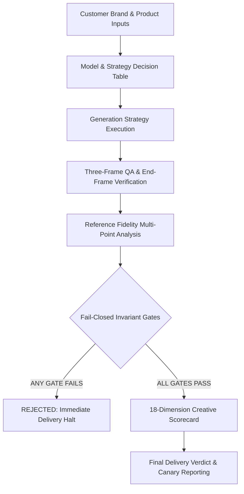

# Video Quality Benchmark & Veo Capability Research

> **Isolated Benchmark Suite — Agent 3**  
> **Branch**: `feature/video-quality-benchmark`  
> **Target Scope**: Quality evaluation, Veo/Flow capability matrix, prompt A/B testing, and QA fixtures.  
> **Invariant**: Production runtime (`services/ai-media-control/`, `services/gflow-engine/`, `services/creative-video-orchestrator/`, `infra/docker-compose.yml`, Supabase migrations, `/canli-takip/ai-media`) remains completely untouched.

---

## 1. Purpose & Core Objective

In our automated video production pipeline, customer tenants provide rich structured branding inputs:

- `org_id` (Tenant organization ID)
- `company_name` / `brand_name` (Firma / Marka Adı)
- `brand_description` (Marka Açıklaması)
- `sector` (Sektör)
- `brand_kit` (Marka Kiti)
- `color_palette` (Hex primary, secondary, accent, neutral)
- `typography` (Heading, body, caption fonts)
- `tone_of_voice` (Kurumsal, dinamik, samimi, lüks, teknik)
- `official_logo_asset` (Vector SVG / high-res PNG logo)
- `product_images` & `reference_images` (Ürün ve referans görselleri)
- `product_details` (Model, teknik özellikler, kullanım alanı)
- `campaign_details` (Kampanya mesajı, sezon, indirim/kampanya)
- `pricing` (Fiyat veya finansman teklifi)
- `cta` (Call-to-Action / Web, telefon, mağaza adresi)
- `target_audience` (Hedef kitle profili)
- `user_prompt_request` (Kullanıcının video talebi)

The objective of this benchmark suite is to **objectively evaluate and grade the visual fidelity, narrative coherence, motion realism, and brand safety** of Google Flow / Veo generated commercials without coupling hardcoded brand logic into production engines.

### Benchmark Fixture Tenants
Brands referenced across this benchmark suite (**Bofe**, **Ayvazoğlu**, and **Veri Burada**) serve strictly as **standardized acceptance fixtures**:
- **Bofe**: Industrial and agricultural machinery fixture (soil cultivation, orchard spraying; tests strict domain grounding against industrial/domestic confusion).
- **Ayvazoğlu**: Architectural ceramics, terracotta bricks, and structural masonry fixture (tests material texture, physical building context, and masonry precision).
- **Veri Burada**: Enterprise B2B SaaS and data intelligence fixture (tests UI legibility, office realism, executive decision narrative).

---

## 2. Directory Structure

```
├── docs/ai-media-benchmark/
│   ├── README.md                      # Architecture overview and benchmark roadmap
│   ├── SHORT_VIDEO_BENCHMARK.md       # 8–15s ad matrix across 6 core commercial categories
│   ├── LONG_VIDEO_BENCHMARK.md        # 30–60s multi-scene commercial benchmark and continuity rules
│   ├── VEO_CAPABILITY_MATRIX.md       # Veo / Flow feature matrix, verified states, and strategy decision table
│   ├── VIDEO_QA_SCORECARD.md          # 18-dimension creative scorecard, 8 fail-closed gates, and 3-frame QA
│   └── PROMPT_AB_TESTS.md             # 4-tier prompt strategy A/B testing pack (R2V, I2V, Cinematography)
│
└── test-fixtures/video-benchmark/
    ├── capability-schema.json         # JSON Schema for account-level Veo/Flow capability audit
    ├── qa-schema.json                 # JSON Schema for fail-closed gates, 3-frame QA, and creative scoring
    ├── short-cases.json               # Test cases for 8–15s commercials (Bofe, Ayvazoğlu, Veri Burada, UGC, Food)
    └── long-cases.json                # Multi-scene 35–40s test cases with per-scene contracts and deterministic CTA
```

---

## 3. Benchmark Pillars



### 1. Fail-Closed Security & Quality Gates
Creative scoring is strictly decoupled from pass/fail invariants. Even if a video achieves high cinematic beauty, violation of any of the 8 absolute gates (**WRONG_PRODUCT**, **WRONG_BRAND**, **FOREIGN_TENANT_ASSET**, **MISSING_REQUIRED_REFERENCE**, **INVALID_OUTPUT**, **BROKEN_VIDEO**, **WRONG_LOGO**, **VALIDATION_BYPASS**) results in automatic delivery rejection.

### 2. Multi-Point Reference Fidelity
Prevents generative model morphing (e.g. turning a brick into concrete or agricultural sprayer into a power tool). Evaluates CIELAB color delta, silhouette IoU, aspect-ratio stability, and mechanical component retention.

### 3. Three-Frame Inspection
- **Short Videos (8–15s)**: Keyframe inspection at **10%**, **50%**, and **90%** of clip runtime.
- **Long Videos (30–60s)**: Per-scene inspection at **15%**, **50%**, and **85%**, plus recording of **scene_end_frame** for parent-to-child visual continuity validation.

### 4. Deterministic Overlays vs Generative AI Hallucinations
Logos, corporate typography, prices, and CTA contact details are never entrusted to generative AI text rendering. Generative engines provide cinematic background plates, while deterministic compositors overlay official vector assets and database strings.

---

## 4. Execution & Canary Evaluation Policy

1. **Zero Real-Credit Generation without Approval**: Benchmarks are evaluated offline against stored video artifacts or canary test runs.
2. **Untested vs Supported Integrity**: In `VEO_CAPABILITY_MATRIX.md`, no capability is marked `SUPPORTED` without verifiable live run execution logs. The default state is strictly `UNTESTED`.
3. **Generic & Modular**: Schemas and benchmark runners consume abstract JSON contracts, ensuring portability across any future model (Veo 2, Imagen 3, Sora, etc.).
