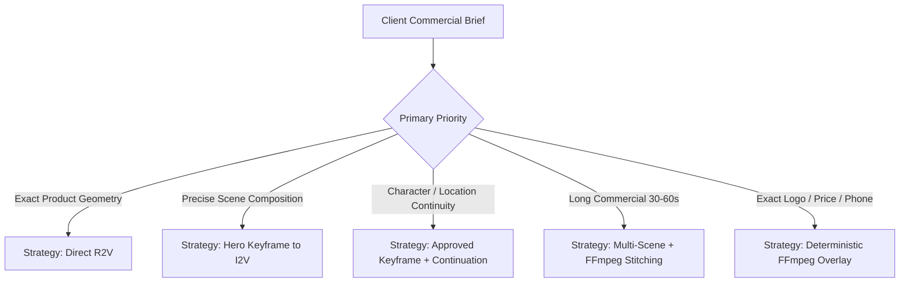

# Veo & Google Flow Platform Capability Matrix

This document defines the capability verification matrix for Google Flow / Veo endpoints, audit states, verified capability records, and the engineering strategy decision table.

---

## 1. Capability Verification Policy

> [!WARNING]
> **Strict Empirical Verification Rule**:  
> No feature may be marked `SUPPORTED` based on marketing documentation, repository READMEs, or vendor announcements.  
> A feature is marked `SUPPORTED` **only if** a live execution canary has run on the specific account and model endpoint, producing a valid, inspected video artifact without fatal errors.  
> If an endpoint has not been tested in live runtime, it must remain strictly **`UNTESTED`**.

### Capability States

| State | Definition | Production Engine Permissibility |
|---|---|---|
| **`SUPPORTED`** | Empirically verified on active account with valid artifact logs. | ✅ Allowed in automated production pipelines. |
| **`UNTESTED`** | Claimed in docs or theorized, but lacks empirical test log on this account. | ⚠️ Blocked from unattended production runs; requires canary run. |
| **`UNSUPPORTED`** | Tested and failed, or explicitly rejected by API/UI schema. | ❌ Strictly forbidden; pipeline must trigger fallback. |
| **`DEGRADED`** | Function operates but produces severe artifacts (e.g. frame tear, audio drift). | ⚠️ Allowed only with manual review flag enabled. |

---

## 2. Model & Endpoint Capability Matrix

| Feature / Dimension | Veo 2 (`veo-2.0-generate-001`) | Veo 2 Preview (`veo-2.0-preview`) | Google Flow UI (`flow_v2_pinpoint`) | Legacy UI (`flow_v1_legacy`) |
|---|---|---|---|---|
| **`t2v` (Text-to-Video)** | `UNTESTED` | `UNTESTED` | `UNTESTED` | `UNTESTED` |
| **`i2v` (Image-to-Video)** | `UNTESTED` | `UNTESTED` | `UNTESTED` | `UNTESTED` |
| **`r2v` (Reference Grounding)** | `UNTESTED` | `UNTESTED` | `UNTESTED` | `UNTESTED` |
| **`first_frame`** | `UNTESTED` | `UNTESTED` | `UNTESTED` | `UNTESTED` |
| **`last_frame`** | `UNTESTED` | `UNTESTED` | `UNTESTED` | `UNTESTED` |
| **`first_last_frame` (Interpolation)** | `UNTESTED` | `UNTESTED` | `UNTESTED` | `UNTESTED` |
| **`extend` (Temporal Extension)** | `UNTESTED` | `UNTESTED` | `UNTESTED` | `UNTESTED` |
| **`chain` (Prompt Chaining)** | `UNTESTED` | `UNTESTED` | `UNTESTED` | `UNTESTED` |
| **`native_audio`** | `UNTESTED` | `UNTESTED` | `UNTESTED` | `UNTESTED` |
| **`duration_control`** | `UNTESTED` | `UNTESTED` | `UNTESTED` | `UNTESTED` |
| **`supported_durations`** | *Awaiting verification* | *Awaiting verification* | *Awaiting verification* | *Awaiting verification* |
| **`aspect_ratios`** | `["9:16", "16:9"]` (*untested*) | `["9:16", "16:9"]` (*untested*) | `["9:16", "16:9"]` (*untested*) | `["16:9"]` (*untested*) |
| **`reference_limit`** | Max 1 (*untested*) | Max 3 (*untested*) | Max 1 (*untested*) | 0 (*untested*) |
| **Overall Endpoint Status** | **`UNTESTED`** | **`UNTESTED`** | **`UNTESTED`** | **`UNTESTED`** |

> *Note: When Agent 1 finalizes the live Flow/Veo infrastructure and canary jobs execute on live accounts, this table will be updated with empirical `tested_at` timestamps and `run_id` hashes.*

---

## 3. Model & Strategy Decision Table

When assembling a commercial brief from customer inputs, the pipeline selects the generation strategy based on the primary creative objective and technical constraints:



| Goal / Requirement | Recommended Strategy | Fallback Strategy (if primary is `UNSUPPORTED`) | Fail-Closed Trigger |
|---|---|---|---|
| **High Product Fidelity**<br/>*(e.g. Bofe machinery, Ayvazoğlu brick)* | **`Direct_R2V`** with explicit physical grounding | **`Hero_Keyframe_I2V`**<br/>(Generate keyframe with 2D/3D reference, then animate) | If both R2V and I2V fail to preserve product silhouette IoU $\ge 0.70$, **FAIL-CLOSED**: reject delivery rather than morphing product. |
| **High Composition Control**<br/>*(e.g. Specific camera framing, lighting, layout)* | **`Hero_Keyframe_to_I2V`** | **`Keyframe_Explicit_Cinematography`**<br/>(Apply camera rig directives) | If keyframe generation fails safety or aesthetic QA, regenerate keyframe; do NOT animate an unapproved frame. |
| **Character & Location Continuity**<br/>*(e.g. Same farmer across 4 scenes)* | **`Approved_Keyframe + Continuation`**<br/>(Feed parent scene end-frame as child start-frame) | **`Independent Scene + Cross-Scene Consistency QA`**<br/>(Strict SSIM $\ge 0.65$ verification) | If child start-frame diverts from parent end-frame by more than allowable delta, reject scene and regenerate. |
| **Long Advertisement (30–60s)**<br/>*(e.g. 5-scene commercial)* | **`Multi-Scene + Deterministic FFmpeg Composition`** | *None* (Monolithic single-prompt 60s generation is prohibited due to drift) | If any individual scene fails QA gates, do NOT stitch master; halt pipeline and report failing scene. |
| **Exact Logo, Text, Pricing, CTA**<br/>*(e.g. Phone number, URL, logo vector)* | **`Deterministic Overlay`**<br/>(FFmpeg subtitle / vector overlay of DB data) | *None* (Never entrust generative video prompts with spelling contact data) | If generative prompt attempts to hallucinate contact phone or website in video pixels, reject generated text frame. |

---

## 4. Fallback Architecture & Failure Matrix

```
┌──────────────────────────────────────────────────────────┐
│              CAPABILITY EXECUTION REQUEST                │
└────────────────────────────┬─────────────────────────────┘
                             │
            ┌────────────────┴────────────────┐
            │                                 │
     Capability is                     Capability is
 `SUPPORTED` & Valid               `UNSUPPORTED` or `UNTESTED`
            │                                 │
            ▼                                 ▼
   Execute Standard Path              Check Decision Table
                                      for Safe Fallback
                                              │
                              ┌───────────────┴───────────────┐
                              │                               │
                       Fallback Available             No Fallback Exists
                              │                               │
                              ▼                               ▼
                     Execute Fallback               FAIL-CLOSED:
                     & Log Warning                  Halt Job, Alert Operator,
                                                    Do NOT Output Degraded Ad
```

### Safety Rules
1. **Never Fall Back to Unconstrained T2V for Branded Products**: If a client uploads a specific brick or sprayer, falling back to pure text-to-video produces generic or competitor products. This triggers `WRONG_PRODUCT` rejection.
2. **Never Let Generative Video Spell Dynamic Phone Numbers**: The AI model has no verified knowledge of customer telephony or URLs and will generate garbled or random phone numbers.
3. **Deterministic Stems for Audio**: If `native_audio` is `UNTESTED` or `UNSUPPORTED`, the audio subsystem routes to independent TTS generation + licensed music ducking via FFmpeg.
