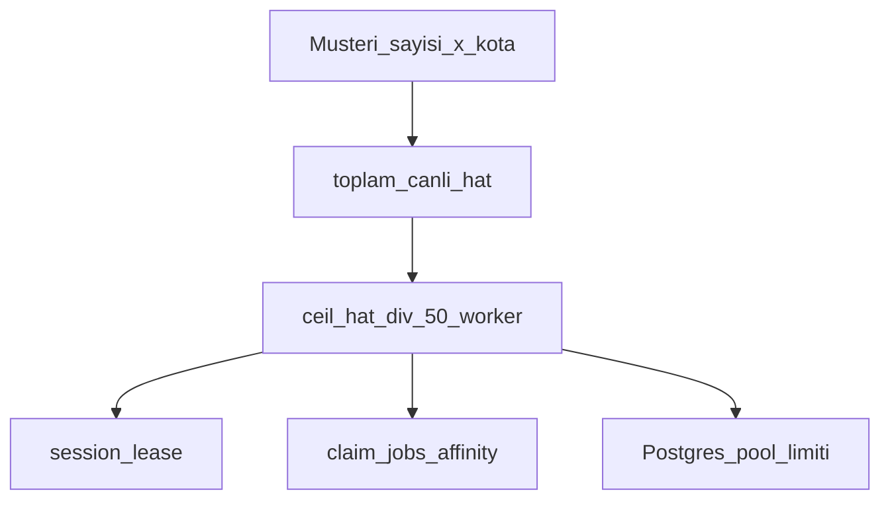

# SaaS ölçek: çok müşteri × çok hat

## Kısa cevap

Sayı (300, 2000, **20 000**) sabit ürün limiti değil.  
**Mimari kaldırır:** multi-tenant `org_id` + paylaşılan worker filosu + lease + job affinity.  
**Tek worker / tek laptop kaldırmaz.** Kaç hat satacağınız → kaç worker + ne kadar RAM/Postgres.

```
hedef_hat          = (sizin sattığınız toplam canlı WhatsApp)
worker_sayisi      = ceil(hedef_hat / MAX_SESSIONS)   # varsayılan MAX_SESSIONS=50
ram_gb_kaba        ≈ hedef_hat * 0.07 + worker_sayisi * 0.5
db_clients_kaba    ≈ worker_sayisi * DB_POOL_MAX      # scale'de DB_POOL_MAX=2
```

| Hedef hat (örnek) | Worker (×50) | RAM (kaba) | DB client (×2) |
|-------------------|--------------|------------|----------------|
| 300 | 6 | ~25 GB | ~12 |
| 2 000 (ör. 20×100) | 40 | ~140 GB | ~80 |
| **20 000 (sallama tavan)** | **400** | **~1.4 TB+** | **~800** |

20 000 = “servis kaldırmıyor” değil; **datacenter / çok VPS / ciddi Postgres** demek. WhatsApp ban/ToS riski ayrı konu.



## Bu repoda hazır olan

- Çok kiracı: `org_id` + RLS  
- Müşteri başına tavan: `organizations.accounts_quota`  
- Yatay ölçek: `WORKER_ID` + `wa.session_lease`  
- İş dağıtımı: `claim_jobs` affinity  
- Health: `sessions.max` / `capacity` (tek worker’ın dilimi; filo toplamı = worker × max)

## Satışa / büyümeye göre ops

1. Filo boyutu = formül — elle replica **veya** [autoscale](./autoscale.md) (`wa.scaler_state.desired_workers`).  
2. Postgres: `desired × DB_POOL_MAX` < pooler limiti (20 000’de session pooler free yetmez → büyük pool / kendi PG).  
3. Paket: org `accounts_quota` (50/100/… ne satıyorsanız).  
4. İzleme: admin Autoscale + heartbeat + her instance `/health`.

Detay deploy: [scale-300.md](./scale-300.md). Autoscale: [autoscale.md](./autoscale.md). Harici VT kiti: [packages/wa-worker-kit](../packages/wa-worker-kit/README.md). Sözleşme: [worker-contract.md](./worker-contract.md).
